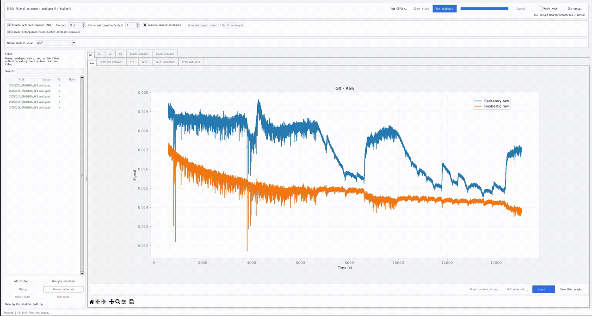
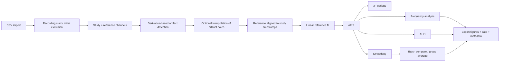

<div align="center">

# FiberLyse

### Transparent, GUI-based fiber photometry analysis

**Import · Inspect · Normalize · Compare · Export**

[](https://www.python.org/)
[](LICENSE)


[Quick start](#quick-start) · [What FiberLyse does](#what-fiberlyse-does) · [Analysis workflow](#analysis-workflow) · [Documentation](#documentation) · [Citation](#citation)

</div>

--- 

## What is FiberLyse?

**FiberLyse** is a desktop application for fiber photometry analysis designed around a simple principle: **the user should be able to see what happens to the signal at every major processing step.**

It provides a graphical workflow for importing recordings, inspecting raw channels, handling artifacts, fitting a reference/control signal, calculating ΔF/F or zF, smoothing, inspecting frequency content, calculating AUC, comparing recordings, and exporting figures and data.

FiberLyse runs locally on your computer. After Python and the required packages are installed, normal use does not require writing code.

> **Current release:** FiberLyse V25  
> V25 is primarily a visual and usability update. The scientific analysis pipeline is inherited from the preceding validated releases.

--- 

## FiberLyse in action

<p align="center">
  
</p>

## Why FiberLyse?

| | |
|---|---|
| **Hardware-flexible CSV import** | Use the built-in Neurophotometrics/Bonsai mapping or define how another CSV stores time, signal, reference, and row types. |
| **Transparent preprocessing** | Inspect raw traces, artifact handling, the fitted reference, normalization, smoothing, and frequency outputs separately. |
| **Timestamp-aware analysis** | The effective sampling rate is calculated from the signal timestamps rather than relying on a manually entered acquisition FPS. |
| **Beginner-friendly interface** | Most analysis choices are exposed in the GUI, with previews, validation, status messages, and graphical controls. |
| **Batch workflows** | Compare multiple recordings or calculate group averages with optional individual traces and SEM. |
| **Reproducible exports** | Export figures and graph-related data together with analysis metadata. |

---

## Quick start

### 1. Download FiberLyse

For now, either clone the repository or download it as a ZIP:

**[Download the repository as ZIP](https://github.com/Krhisphfer-Fly/FiberLyse/archive/refs/heads/main.zip)**


### 2. Install Python

Install a current Python 3 release from [python.org](https://www.python.org/downloads/).

On Windows, the standard python.org installer includes **Tkinter**, which FiberLyse uses for its desktop interface.

### 3. Install the dependencies

Open a terminal in the FiberLyse folder and run:

```bash
python -m pip install -r requirements.txt
```

On Windows, this command also commonly works:

```powershell
py -m pip install -r requirements.txt
```

### 4. Start FiberLyse

```bash
python FiberLyse.py
```

or on Windows:

```powershell
py FiberLyse.py
```

### 5. Load a recording

Use **Add CSV(s)…** and, when needed, **CSV setup…** to tell FiberLyse how the file is organized. Then run the analysis and inspect the individual processing tabs before exporting results.

> New to the program? Read **[Getting started](docs/getting-started.md)** for a first-analysis walkthrough.

---

## What FiberLyse does

### Importing data

FiberLyse currently supports three CSV workflows:

1. **Neurophotometrics / Bonsai**  
   Built-in mapping for files containing fields such as `SystemTimestamp`, `LedState`, and `G0`, `G1`, etc.

2. **Signal and reference in separate columns**  
   Each row contains a time value plus separate columns for the study signal and its comparison/reference signal. Multiple signal/reference pairs can be defined.

3. **Signal and reference interleaved in rows**  
   Signal and reference measurements take turns in the rows, while another column identifies the row type/state.

The CSV setup wizard can also account for different delimiters and decimal conventions, including semicolon-separated files with decimal commas.

**[Read the import guide →](docs/importing-data.md)**

---

## Analysis workflow



### Artifact handling

FiberLyse detects abrupt changes using the derivative of the fluorescence trace and a robust **MAD-based** threshold. Artifact detection can be restricted to events shared between study and reference channels. Detected regions can remain as holes or be linearly interpolated for analyses where interpolation is enabled.

### Reference fit and ΔF/F

The reference/control trace is aligned to the study timestamps and fitted using a linear model:

```text
study ≈ coefficient × reference + intercept
```

FiberLyse then calculates:

```text
ΔF/F = (study − fitted reference) / fitted reference
```

The fitted-reference graph is intentionally exposed so the user can inspect the fit rather than treating normalization as a black box.

### zF and smoothing

FiberLyse provides global zF and interval-based zF views in addition to ΔF/F. Smoothed normalization traces use the program's centered moving-average implementation while preserving gaps rather than smoothing directly across missing regions.

**[Read the analysis workflow →](docs/analysis-workflow.md)**

---

## Frequency analysis

FiberLyse V24+ redesigned frequency analysis around the **sampling rate actually present in the current signal timestamps**.

The frequency tools provide:

- timestamp-derived effective sampling rate;
- Nyquist-aware validation of requested bands;
- standard FiberLyse bands;
- automatically generated bands for the current recording;
- custom frequency bands;
- Butterworth band-pass filtering;
- Welch power spectral density when SciPy is available;
- time-based PSD window settings;
- handling of large timestamp gaps as separate continuous sections;
- metadata fields for original acquisition rate/downsampling history without using those values to invent frequency information that is absent from the current file.

A requested band that exceeds the current file's measurable frequency range is marked **unavailable** instead of being silently clipped.

**[Read the frequency guide →](docs/frequency-analysis.md)**

---

## Batch analysis

FiberLyse includes two application-level batch views:

### Batch compare

Overlay selected recordings/channels on one graph for direct visual comparison.

### Batch average

Create Group A and Group B averages with optional:

- individual traces;
- SEM shading;
- smoothed-trace averaging.

Batch alignment is restricted to shared time support and does not intentionally extrapolate recordings beyond their available timestamps.

---

## AUC and graph tools

For visible line traces, FiberLyse can calculate interval-based:

- signed AUC;
- absolute AUC;
- positive AUC;
- negative AUC;
- usable interval coverage;
- mean signal relative to a selected baseline.

Graph tools also include:

- line and interval event annotations;
- editable plot/axis/legend text;
- graph color customization;
- visible axis-range controls;
- tick-interval controls;
- font-size controls;
- light and night modes.

---


## Useful controls & shortcuts

Most FiberLyse controls are visible directly in the GUI. The items below are the less obvious controls that are useful to know.

### Plot interaction

- **Drag across the Fit plot** to choose a new fitting interval. FiberLyse will recalculate the control-signal fit and downstream normalization.
- **Double-click plot text** to rename titles, axis labels, or legend entries.
- **Right-click a plotted trace or legend entry** to change its color using a hex code such as `#3366CC`.
- **Graph customization…** lets you adjust axis limits, tick spacing, font sizes, and legend appearance without changing the underlying data.

### Keyboard shortcuts

| Shortcut | Action |
|---|---|
| **Ctrl+I** | Add a vertical event line or shaded time interval to the active plot. |
| **Ctrl+U** | Open the Area Under the Curve (AUC) calculator. |
| **Ctrl+K** | Open graph customization. |
| **Ctrl+L** | Open graph customization focused on the legend. |
| **Ctrl+J** | Show the mapping between loaded files and their file numbers. |
| **Ctrl+Backspace** | Remove the most recently added event annotation while the event dialog is open. |

### Artifact removal

The most important artifact controls are:

- **Factor** — controls how sensitive the MAD-based artifact detector is. Higher values are more conservative.
- **Extra pad** — removes additional samples around a detected artifact.
- **Require shared artifacts** — only removes events detected in both the study and reference signals.
- **Linear interpolate holes** — optionally fills gaps created by artifact removal.

The **Artifact remover** plot should be inspected whenever these settings are changed.

### Frequency analysis

FiberLyse determines the current signal sampling rate directly from the timestamps in the recording.

In **Frequency settings…** you can choose:

- FiberLyse standard frequency bands;
- automatically generated bands based on the measurable frequency range;
- custom frequency bands;
- Welch spectrum window length and overlap;
- Butterworth filter order.

Bands that exceed the recording's Nyquist limit are marked unavailable rather than being silently adjusted.

### Batch tools

- **Batch compare** overlays selected recordings.
- **Batch average** compares Group A and Group B and can display individual traces and SEM shading.
- Batch alignment only uses the time range shared by the recordings and does not extrapolate beyond available data.

### Export

Use **Export…** to export multiple plots at once and optionally include the numerical data associated with each selected graph.

Individual plots can also be saved directly as PNG, SVG, or PDF.


## Export

FiberLyse can export individual graph data to Excel and save plots as common publication-friendly formats such as PNG, SVG, and PDF.

The centralized export workflow can select graph types across source files and can include graph-related data/metadata, including information about import mappings and frequency-analysis settings where relevant.

---


<!--
Once the images are uploaded, a compact gallery can be enabled here, for example:

<p align="center">
  
  
</p>
-->

---

## Documentation

| Guide | Purpose |
|---|---|
| **[Getting started](docs/getting-started.md)** | Install FiberLyse and complete a first analysis. |
| **[Importing data](docs/importing-data.md)** | Configure Neurophotometrics/Bonsai or custom CSV layouts. |
| **[Analysis workflow](docs/analysis-workflow.md)** | Understand artifact handling, fitting, normalization, smoothing, AUC, and batch analysis. |
| **[Frequency analysis](docs/frequency-analysis.md)** | Understand timestamp-derived sampling rate, Nyquist limits, PSD, and frequency bands. |
| **[Troubleshooting](docs/troubleshooting.md)** | Common installation, import, fitting, and frequency-analysis problems. |

---

## Repository structure

```text
FiberLyse/
├── FiberLyse.py
├── README.md
├── requirements.txt
├── CITATION.cff
├── LICENSE
├── assets/
│   └── README.md
└── docs/
    ├── getting-started.md
    ├── importing-data.md
    ├── analysis-workflow.md
    ├── frequency-analysis.md
    └── troubleshooting.md
```

---

## Citation

If FiberLyse contributes to your research, please cite the software.

This repository includes a **`CITATION.cff`** file so GitHub can expose a **Cite this repository** option. The citation metadata can later be expanded with author details, an ORCID, a publication, or a Zenodo DOI.

> Before a public scientific release, update the temporary author entry in `CITATION.cff` from the GitHub account name to the preferred author name and ORCID if applicable.

---

## Contributing and feedback

Bug reports, reproducible examples, usability feedback, and suggestions for additional acquisition formats are welcome through **[GitHub Issues](https://github.com/Krhisphfer-Fly/FiberLyse/issues)**.

When reporting an analysis issue, please include:

- FiberLyse version;
- operating system;
- the CSV layout/import profile used;
- the relevant analysis settings;
- the error message or a screenshot;
- a small example dataset when it can be shared.

---

## Research-use note

FiberLyse is research software. Analysis settings should be chosen and validated for the specific experiment, acquisition system, sampling history, and scientific question. Users should inspect intermediate plots and exported metadata rather than treating the GUI output as an automatic biological interpretation.

---

## License

FiberLyse is released under the **MIT License**. See [LICENSE](LICENSE).


</div>
